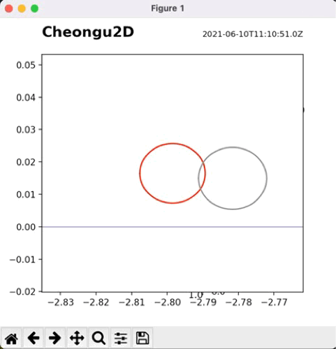

# SolarSystemModel
Personal project aimed for creating close-to-accurate model of a solar system with keplerian ellipse orbit🪐

### Simulation examples
|Orbit simulation|eclipse simulation|
|--|--|
|||

## Overview
### Primary goal
Primary goal is to create an accurate predictive model of solar eclipses, although opened to implementing more analysis tools along the way.

### Dependencies
- Python 3.9.0
- Numpy 1.20.1
- Matplotlib 3.3.4
- timezonefinder 5.2.0
- pytz 2021.1
- joblib 1.0.1

### Current tools
1. 2D/3D plot of solar system
    - Orbit plot
    - 2D/3D Earth-Centric/Local Celestial sphere plot
2. 2D/3D animation of solar system
3. eclipse prediction tool


## Specifications
### 1. Configuring & Loading model info
You first need to load a model configuration info using **json** format. We currently only have a model config file for the Sun/Earth/Moon, but more celestial bodies can be added under '**elements**' list.
#### Example
```json
    {
      "name": "Mars",
      "mass_kg": 6.4171e+23,
      "diameter_km": 6779e+4,
      "orbit":{
        "center_body": "Sun",
        "e": 0.094,
        "a_km": 227.9392e+6,
        "node_lon_rad": 1.33831847,
        "incln_rad": 0.06736970913,
        "periap_ang_rad": 0.9579065067,
        "apsidal_prcs": 3233,
        "nodal_prcs": -6793,
        "anom_true_rad": 0.11195463893540733
      }
    }
```
### 2.