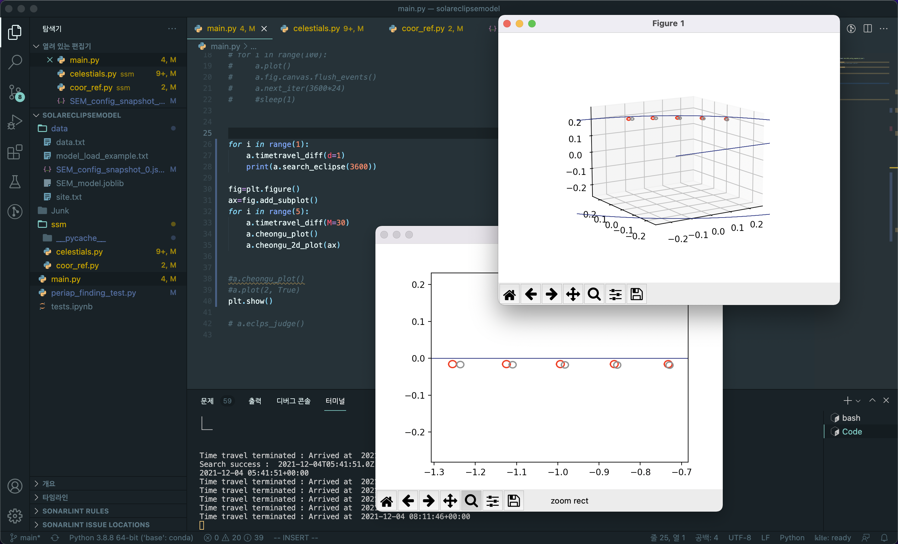

# SolarSystemModel
Personal project aimed for creating close-to-accurate model of a solar system with keplerian ellipse orbit🪐

## Overview
### Primary goal
Primary goal is to create an accurate predictive model of solar eclipses, although opened to implementing more analysis tools along the way.

### Package Dependencies
- Numpy
- Matplotlib
- timezonefinder
- pytz
- etc...(specifics will be added)

### Current tools
1. 2D/3D plot of solar system
2. 2D/3D animation of solar system
3. eclipse prediction tool

## Specifications
